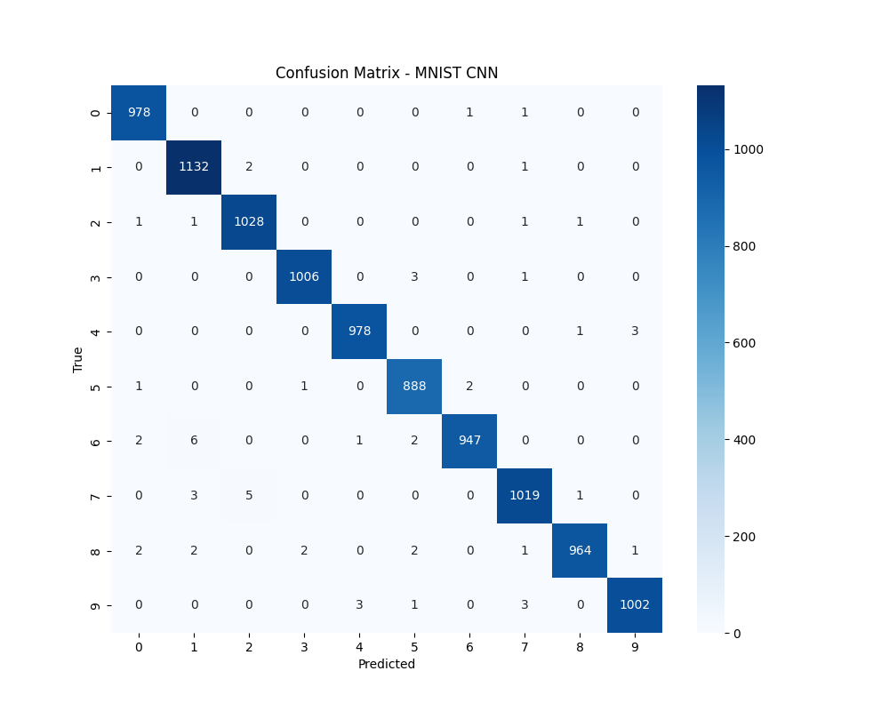

# Robust Handwritten Digit Recognition using CNN (MNIST)

[](https://www.python.org/)
[](https://pytorch.org/)
[](https://opensource.org/licenses/MIT)

A production-ready CNN built from scratch using PyTorch to classify handwritten digits (0–9) from the MNIST dataset. The model achieves **99.42% test accuracy** with advanced data augmentation, leakage‑free validation split, and adaptive inference preprocessing.

---

## Features

- Custom CNN with 2 convolutional blocks + 2 fully connected layers
- Batch normalization and dropout for regularization
- Data augmentation: RandomRotation, RandomAffine, RandomErasing
- Leakage‑free train/validation split (54k / 6k)
- Adaptive pixel inversion for real‑world image inference
- GPU acceleration support (auto fallback to CPU)
- Confusion matrix and training logs saved automatically

---

## Results

| Metric                    | Value      |
|---------------------------|------------|
| Best Validation Accuracy  | 99.32%     |
| **Final Test Accuracy**   | **99.42%** |
| Inference Latency (CPU)   | ~2.4ms     |

### Confusion Matrix


---

## 📂 Project Structure
mnist-digit-recognition/
├── data/ # MNIST raw data (auto-downloaded)
├── reports/ # Confusion matrix & plots
├── .gitignore
├── LICENSE
├── README.md
├── requirements.txt
├── model.py # CNN architecture
├── train.py # Training & evaluation script
└── predict.py # CLI inference for single images

text

---

## 🛠️ Tech Stack

| Component               | Technology                                      |
|-------------------------|-------------------------------------------------|
| Framework               | PyTorch                                         |
| Architecture            | Custom CNN (2 Conv + 2 FC)                      |
| Image preprocessing     | `transforms` (Resize, ToTensor, Normalize)      |
| Data augmentation       | RandomRotation, RandomAffine, RandomErasing     |
| Loss & Optimizer        | CrossEntropyLoss, Adam (lr=0.001)               |
| Evaluation              | Confusion matrix, classification report         |
| Dataset                 | MNIST (handwritten digits 0–9)                  |
| Reproducibility         | Fixed random seed (42)                          |

---

# 🔧 How to Run

### 1. Clone the repository
```bash
git clone [https://github.com/Aylis59781/mnist-digit-recognition.git](https://github.com/Aylis59781/mnist-digit-recognition.git)
cd mnist-digit-recognition


2. Install dependencies

Bash
pip install -r requirements.txt


3. Train the model

Bash
python train.py

4. Run inference on a single image

Bash
python predict.py path/to/digit_image.png

The system automatically inverts the image if the background is light (adaptive preprocessing).


Future Improvements

Implement attention mechanism for better feature extraction
Deploy model as a web app using Streamlit or Gradio
Extend to multi-language handwritten digit recognition
Use model quantization for edge device deployment


Learning Resources

MNIST Dataset
PyTorch Documentation
Convolutional Neural Networks (CS231n)


📄 Citation

Code snippet
@software{Mir_Nazmul_Ali_MNIST_CNN_2026,
  author = {Mir Nazmul Ali},
  title = {Handwritten Digit Recognition using CNN on MNIST},
  year = {2026},
  url = {[https://github.com/Aylis59781/mnist-digit-recognition](https://github.com/Aylis59781/mnist-digit-recognition)}
}


📌 Author

Mir Nazmul Ali
Research focus: Deep Learning, Computer Vision, Edge AI


📜 License

Distributed under the MIT License. See LICENSE for more information.
